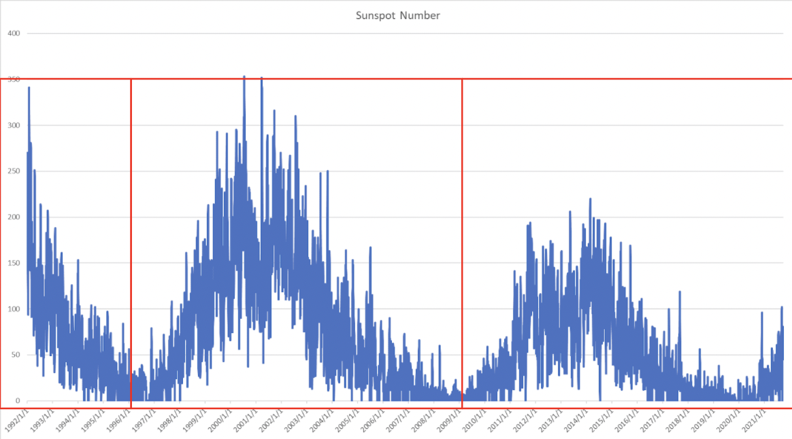
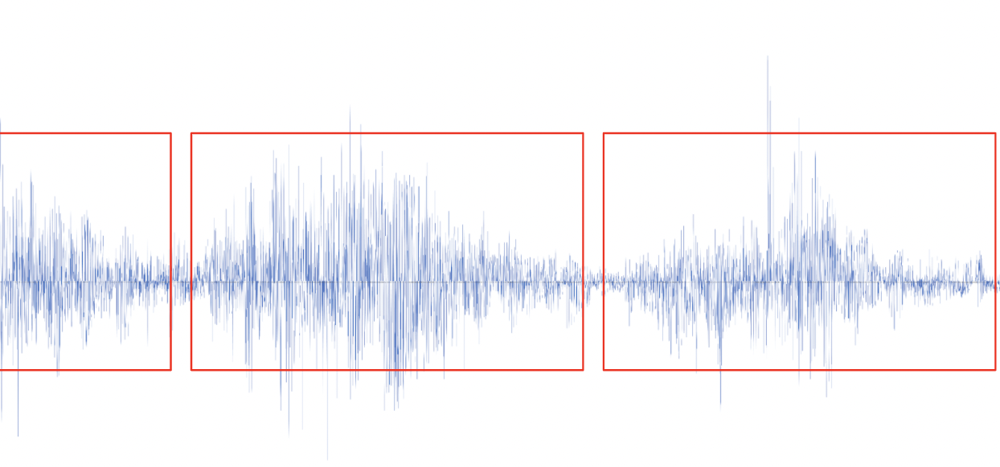
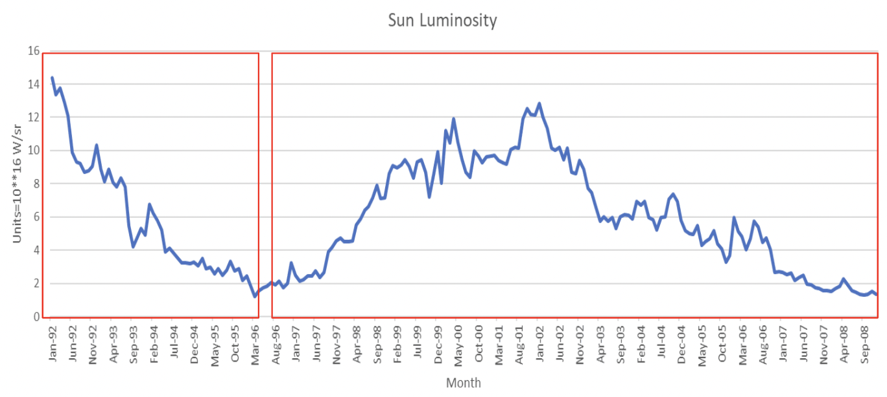

# Solar-Cycle

Steps took to analyze change in Sunspot Change from 1992 to 2020 (Yizhou Wan):

1. Used code in etl_code/etl_sunSpot/MapReduce directory to normalize the raw file and retrieve only the number of sunspots of each day of the years

2. Converted the above normalized file as txt file and sent it to Final_Proj/Hive_Table/second_num to create a Hive table for analysis

3. Ran the commands in profiling_code/profiling_sunSpot/hive_command_for_sunspots.txt which created four Hive tables (one main table and three sub tables of each cycle)

4. Calculated the max, min and average of the sunspot number of each cycle

5. The results can be found in ana_code/ana_sunSpot/analysis_using_hive directory

Steps took to analyze change in Solar Magnetic Field Strength from 1992 to 2020 (Anni Zheng):

1. /data_ingest/data_ingest_sunMag directory contains two txt files indicating the steps of dowloading data from the internet and uploading them to Peel

2. /etl_code/etl_sunMag directory contains a /etl_code/etl_sunMag/sunMag file that uses MapReduce to convert raw data into data with specific format (*year, month, day, magnetic field strength*) that helps us to either interpret that data in Hive or visualize it. On the other hand, etl_code/etl_sunMag/peel_execute.txt contains command line codes for running MapReduce job on Peel

3. /profiling_code/profiling_sunMag/hive_sunmag.txt contains command lines that load normalized data generated from the last step to a Hive table. It also contains commands used for data analysis

4. /ana_code/ana_sunMag/analysis_using_hive.pdf contains screenshots of the execution of analytical hive commands. It mainly displays the result of calculating the maximum, minimum, and average magnetic field strength of each 11-year solar cycle, which we may use to compare between different solar cycles

Steps took to analyze change in Sunspot Change from 1992 to 2020 (Yizhou Wan, Anni Zheng):

1. Raw data is in etl_code/etl_Luminosity/Lomnicky

2. Used shell scripts and python code in the etl_code/etl_Luminosity/Data_Filter_Lomnicky/data_merge.py to produce total_year.txt

3. Finally, used codes in etl_code/etl_Luminosity/normalizeLuminosity to normalize the luminosity data into a specific form for data visualization

